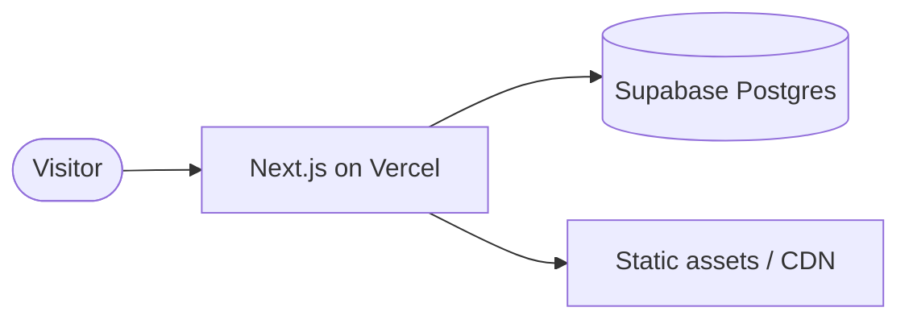

# Architecture — {{ project-name }}

> System design at a glance. Update when major components change. Detailed per-decision rationale lives in `docs/adr/`.

## Context diagram

## Components

### Frontend — Next.js (App Router)
- **Where:** `src/app/`
- **Rendering:** Server Components by default; client only when interactive
- **Data fetching:** server-side via `@supabase/supabase-js` with anon key

### Database — Supabase
- **Schema source of truth:** `db/schema.sql`
- **Access pattern:** anon role + RLS policies. No service-role calls from the client.
- **Migrations:** `db/migrations/<timestamp>__<name>.sql`, append-only

### Hosting — Vercel
- **Project ID:** see `.env` → `VERCEL_PROJECT_ID`
- **Branch deploys:** every PR gets a preview URL
- **Prod branch:** `main`

## Key decisions

- No login/auth — public app. Writes throttled at DB level (RLS + rate limits).
- All secrets server-side only. Anon key is the only key that ships to the browser.

## Out-of-scope (today)

- Multi-tenant
- Background jobs / queues
- Real-time subscriptions (revisit if needed)
