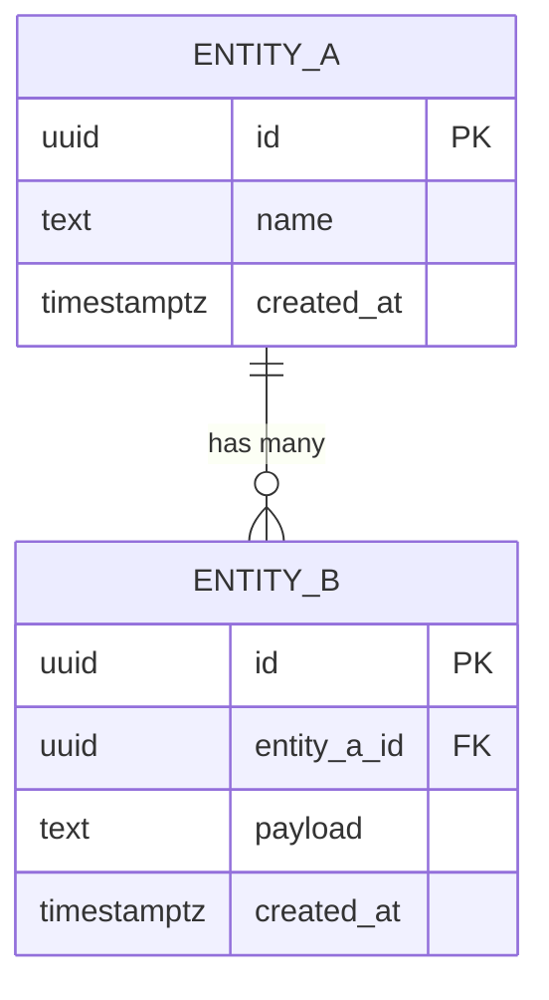

# ER Diagram — {{ project-name }}

> Mermaid `erDiagram`. GitHub renders this natively. Keep it in sync with `db/schema.sql`.

## Notation

- `||--o{` — one-to-many
- `||--||` — one-to-one
- `}o--o{` — many-to-many (resolve via join table)
- `PK` — primary key
- `FK` — foreign key

## Update protocol

1. Change `db/schema.sql`
2. Update this diagram
3. Add a migration in `db/migrations/`
4. Verify rendering in the GitHub PR preview before merging
