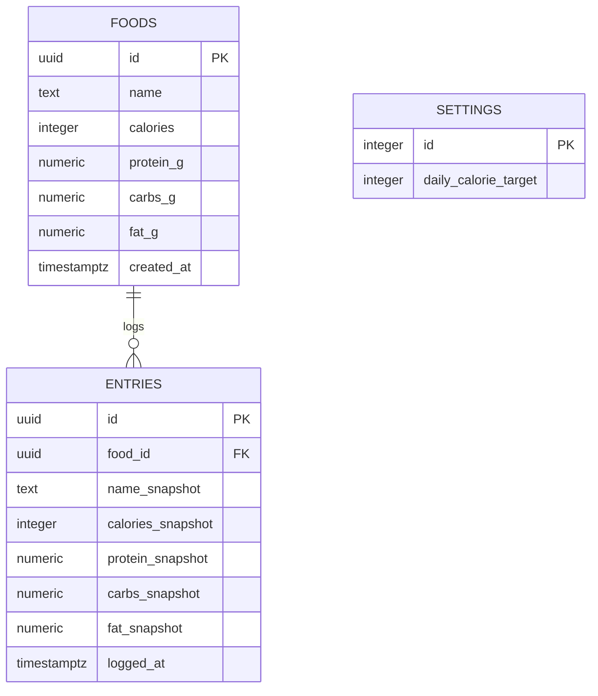

# ER Diagram — calorie-tracker

> Mermaid `erDiagram`. GitHub renders this natively. Keep it in sync with `db/schema.sql` and `db/sqlite/schema.sql`.

## Notes

- `entries.food_id` is **nullable** with `on delete set null`. Deleting a food preserves history; the snapshot columns keep the entry self-describing.
- **Snapshot semantics**: `entries.*_snapshot` columns capture nutrition at log time. Editing a food's catalog row does not retroactively change historical totals.
- `settings` is a **singleton** — `check (id = 1)` enforces a single row. The seed migration inserts `(1, 2000)` so a fresh database renders a working progress bar immediately.
- `foods` has a **unique index on `lower(name)`** to enable the upsert pattern (`on conflict (lower(name)) do update …`) without a select-then-write race.

## Notation

- `||--o{` — one-to-many
- `||--||` — one-to-one
- `}o--o{` — many-to-many (resolve via join table)
- `PK` — primary key
- `FK` — foreign key

## Update protocol

1. Change `db/schema.sql` and `db/sqlite/schema.sql` (siblings, not generated)
2. Add a migration pair in `db/migrations/` and `db/sqlite/migrations/` with the same timestamp prefix
3. Update this diagram
4. Verify rendering in the GitHub PR preview before merging
